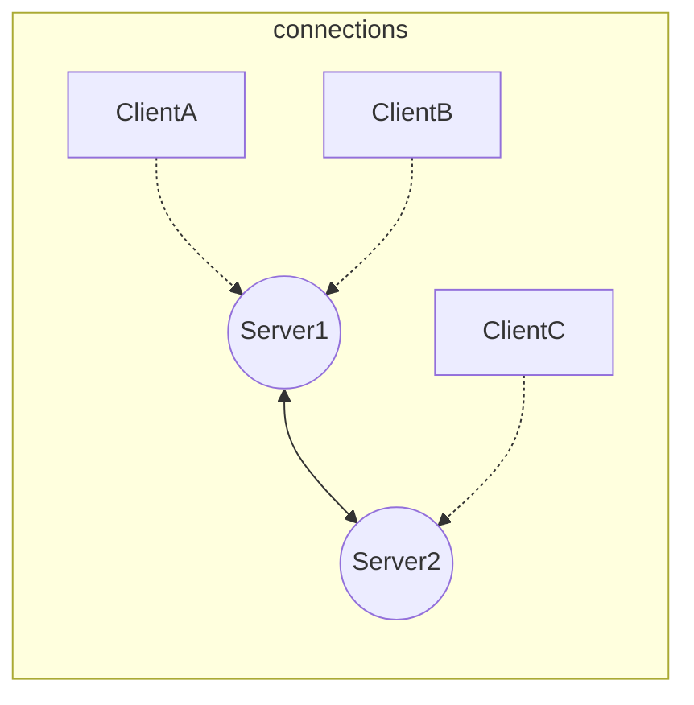
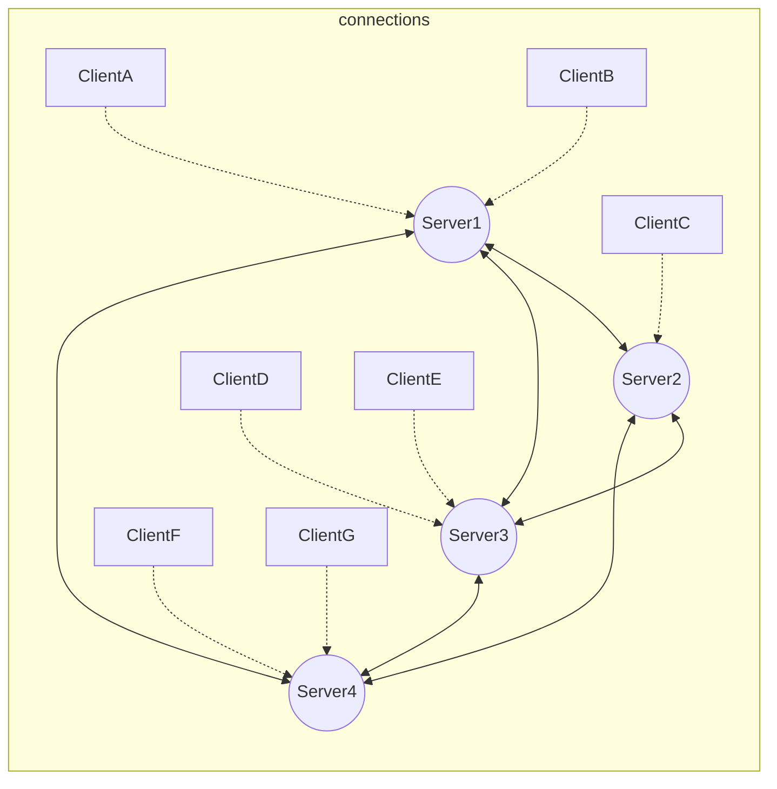

# OLAF/Neighbourhood Protocol v1.1.1 Chat Server

This project implements a decentralized, encrypted chat server using the OLAF/Neighbourhood Protocol. The server uses RSA for key exchange, AES-GCM for secure communication, and WebSockets for real-time communication. This implementation allows clients to send messages through their home server, and messages can travel between interconnected servers within a neighborhood. 

Clients can only connect to their home server and communicate with users on the same server or on servers directly connected to their home server.

## Features

- **End-to-End Encryption**: Messages are secured using RSA for key exchange and AES-GCM for encryption.
- **Replay Attack Prevention**: Signed messages with a monotonically increasing counter prevent replay attacks.
- **Decentralized Topology**: Servers form a neighborhood, and users can communicate across servers.
- **Private and Group Messaging**: Clients can send encrypted messages directly to other users or to a group.
- **File Upload and Download**: Support for file uploads and downloads via HTTP.
- **Server Synchronization**: Servers sync their connected clients with each other.

## Table of Contents

- [OLAF/Neighbourhood Protocol v1.1.1 Chat Server](#olafneighbourhood-protocol-v111-chat-server)
  - [Features](#features)
  - [Table of Contents](#table-of-contents)
  - [Installation](#installation)
    - [Prerequisites](#prerequisites)
    - [Install Dependencies](#install-dependencies)
  - [Usage](#usage)
    - [Starting the Server](#starting-the-server)
    - [Client-Server Communication](#client-server-communication)
    - [Network Topology Examples](#network-topology-examples)
      - [Simple Neighborhood](#simple-neighborhood)
      - [Complex Neighborhood](#complex-neighborhood)
    - [Commands](#commands)
    - [Example Client Usage](#example-client-usage)
  - [API Endpoints](#api-endpoints)
    - [Upload a File](#upload-a-file)
    - [Download a File](#download-a-file)
  - [Protocol Overview](#protocol-overview)
    - [Message Structure](#message-structure)
    - [Encryption Details](#encryption-details)
  - [Logging](#logging)
  - [Contributing](#contributing)

## Installation

### Prerequisites

Ensure you have the following installed:

- **Python 3.8+**
- **pip** (Python package installer)

### Install Dependencies

1. Clone the repository:
    ```bash
    git clone https://github.com/your-repository/olaf-chat-server.git
    cd olaf-chat-server
    ```

2. Install the required Python packages:
    ```bash
    pip install -r requirements.txt
    ```

## Usage

### Starting the Server

Run the server using the following command:

```bash
python server.py
```

By default, the WebSocket server will start on `ws://0.0.0.0:8080`, and the HTTP server for file handling will run on `http://0.0.0.0:8000`.

### Client-Server Communication

Each client connects to one server at a time, which becomes their **home server**. The server forwards messages to other connected servers and clients. Clients can only communicate with users on their home server or users on servers directly connected to their home server.

Messages between clients are encrypted using a combination of RSA and AES-GCM encryption to ensure end-to-end security.

### Network Topology Examples

#### Simple Neighborhood
In this example, each client is directly connected to the same or directly connected servers. All clients can communicate with one another.



#### Complex Neighborhood
Here, all clients can communicate, either by being on the same server or through interconnected servers in the neighborhood.



### Commands

Once connected, clients can use the following commands:

- **/list**: Show online users across all servers.
- **/broadcast `<message>`**: Send a broadcast message to all users in the neighborhood.
- **/msg `<username>` `<message>`**: Send a private message to a specific user.
- **/get_public_key `<username>`**: Retrieve the public key of a specific user.
- **/upload `<filepath>`**: Upload a file to the server.
- **/download `<file_url>`**: Download a file from the server.

### Example Client Usage

The client establishes a WebSocket connection and communicates using the server’s public key for encryption.

Example flow:
1. The client sends a `hello` message with their public key.
2. The server responds with an acknowledgment and the list of connected clients.
3. Clients can then send encrypted messages to each other through their home server.

## API Endpoints

The server exposes HTTP endpoints for file uploads and downloads.

### Upload a File

```bash
POST /api/upload
```

- **Request**: Send a multipart form-data request with a file field containing the file.
- **Response**: Returns the URL to access the uploaded file.

Example:

```bash
curl -F "file=@/path/to/yourfile.txt" http://localhost:8000/api/upload
```

### Download a File

```bash
GET /files/<filename>
```

- **Request**: Use the filename returned from the upload response.
- **Response**: The file will be returned as a binary stream.

Example:

```bash
curl -O http://localhost:8000/files/yourfile.txt
```

## Protocol Overview

The protocol follows the **OLAF/Neighborhood Protocol**, where clients connect to a single server and servers form neighborhoods to facilitate communication.

### Message Structure

All messages follow the below structure:

```JSON
{
    "type": "signed_data",
    "data": {  },
    "counter": 12345,
    "signature": "<Base64 signature of data + counter>"
}
```

- **counter**: A monotonically increasing integer that prevents replay attacks.
- **signature**: Generated using RSA-PSS with SHA-256 and ensures the integrity of the message.

### Encryption Details

- **RSA**: Used for key exchange and message signing. Key length: 2048 bits.
- **AES-GCM**: Used for encrypting message payloads. AES-256 is the default key size.
- **Message Signing**: All messages are signed using RSA-PSS with SHA-256 to ensure authenticity and prevent tampering.

Messages include a counter that prevents replay attacks by ensuring that each message has a unique incrementing value.

## Logging

By default, the server outputs `INFO` level logs to the console, including connections, disconnections, and message flow. For more detailed logs, you can enable `DEBUG` level logging:

```python
import logging
logging.getLogger('websockets').setLevel(logging.DEBUG)
```

To reduce `websockets` library output, set it to `INFO` or higher.

## Contributing

1. Fork the repository.
2. Create a new branch for your feature.
3. Submit a pull request with a detailed description of your changes.
